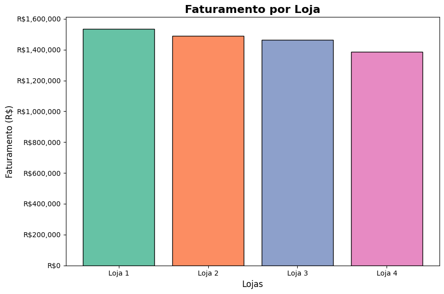
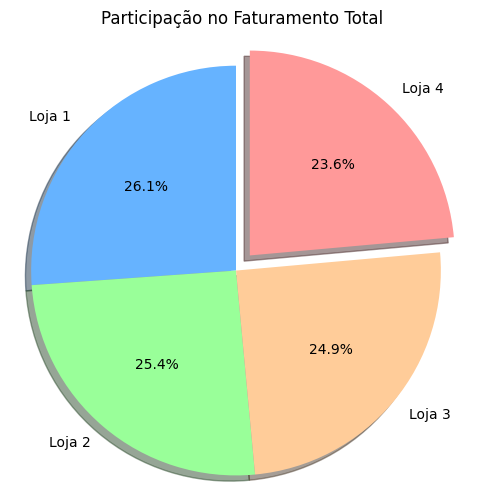
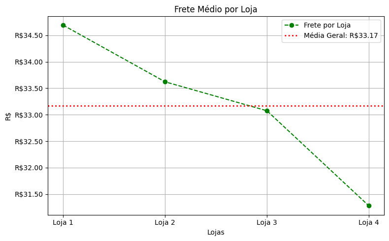

# AluraStore - Análise de Vendas

Este projeto tem como objetivo analisar os dados de vendas de quatro lojas do Sr. João. A análise foi realizada com base nos seguintes critérios:

- Faturamento total por loja
- Frete médio por loja
- Avaliação das lojas

Foram utilizados gráficos personalizados para visualização dos dados e suporte à tomada de decisão.

## 📊 Gráfico de Barras - Faturamento Total por Loja

Representação do total faturado por cada loja. O gráfico evidencia que a **Loja 4** apresentou o menor desempenho em vendas.

## 🧁 Gráfico de Pizza - Distribuição Percentual do Faturamento

Este gráfico mostra a participação percentual de cada loja no total de faturamento, permitindo rápida comparação visual.

## 📈 Gráfico de Linha - Frete Médio por Loja

Analisamos o frete médio de cada loja com uma linha de referência representando a média geral. Embora os valores sejam próximos, é possível observar ligeiras variações.

## 📌 Conclusões

- As avaliações das lojas foram idênticas, não influenciando a decisão.
- O frete médio entre as lojas teve pouca variação.
- O **faturamento total** foi o fator determinante: **a Loja 4 teve o menor faturamento** e, portanto, o menor desempenho.

---

Projeto desenvolvido com o uso de Python e a biblioteca Matplotlib para visualização de dados.
